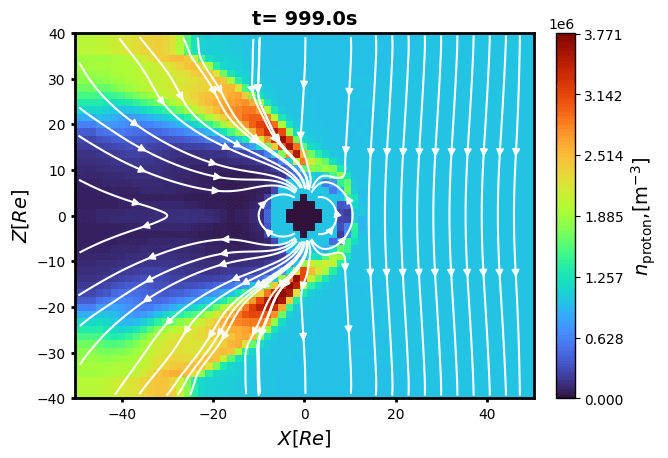
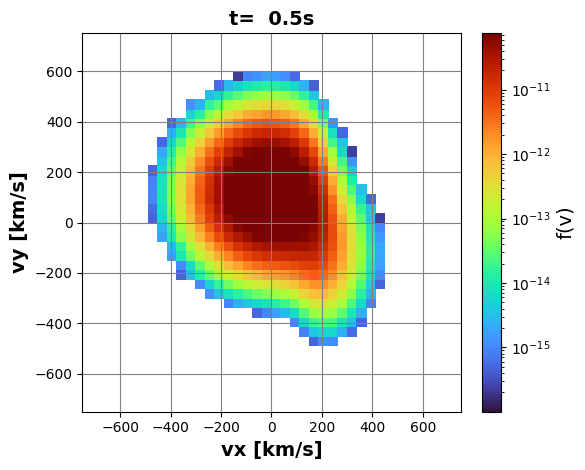

# Examples

## Loading VLSV data

- Read meta data
```
filename = "bulk.0000004.vlsv"
meta = readmeta(filename)
```

- Display all variable names
```
vars = showvariables(meta)
```

- Read variable
```
data = readvariable(meta, "proton/vg_rho")
```

The same interface works for both DCCRG grid and FS grid variables.
By default the returned DCCRG grid variable array is sorted by cell IDs.
If in any case you want the original unsorted version as being stored in the file,
simply say `readvariable(meta, var, false)`.

- Get variable at a given location (This can be simplified even further later!)
```
loc = [2.0, 0.0, 0.0]
id = getcell(meta, loc)
readvariable(meta, "proton/vg_rho", id)
```

- Get variable along a line between two points
```
point1 = [12Re, 0, 0]
point2 = [15Re, 0, 0]
cellids, distances, coords = getcellinline(meta, point1, point2)
```

Combined with external packages like [FieldTracer.jl](https://github.com/henry2004y/FieldTracer.jl), it is possible to do all kinds of in-depth analysis.
More examples can be found in the [repo](https://github.com/henry2004y/Vlasiator.jl/tree/master/src/examples).

## Computing derived quantities

Vlasiator is capable of computing moments and some derived quantities and save them directly into VLSV files.
More derived quantities computed from the saved quantities are also available in postprocessing, such as plasma β, velocity parallel/perpendicular to the magnetic field, pressure tensor with the third axis aligned with the magnetic field direction and so on.
To avoid confusion about variable names, the convention here is that
* if it is directly stored in the VLSV file, read the raw data;
* otherwise check the availability in the derived variable list. All predefined names start with a capital letter.

To obtain a derived quantity, for example,
```
beta = readvariable(meta, "Beta")
```

Here is a full list of available quantities[^1]:

| Derived variable name | Meaning                          | Required variable |
|-----------------------|----------------------------------|-------------------|
| Bmag                  | magnetic field magnitude         | vg\_b\_vol        |
| Emag                  | electric field magnitude         | vg\_e\_vol        |
| Vmag                  | bulk speed                       | vg\_v             |
| VS                    | sound speed                      | vg\_ptensor\_diagonal; vg\_rho |
| VA                    | Alfvén speed                     | vg\_rho; Bmag     |
| MA                    | Alfvén Mach number               | Vmag; VA          |
| Upar                  | bulk velocity $\parallel\mathbf{B}$| vg\_v; vg\_b\_vol |
| Uperp                 | bulk velocity $\perp \mathbf{B}$ | vg\_v; vg\_b\_vol |
| P                     | scalar thermal pressure          | vg\_ptensor\_diagonal |
| T                     | scalar temperature               | P; vg\_rho        |
| Tpar                  | temperature $\parallel\mathbf{B}$| vg\_rho; vg\_ptensor\_diagonal; vg\_b\_vol |
| Tperp                 | temperature $\perp \mathbf{B}$   | vg\_rho; vg\_ptensor\_offdiagonal; vg\_b\_vol |
| Protated              | pressure tensor with $\widehat{z} \parallel \mathbf{B}$ | vg\_b\_vol; vg\_ptensor\_diagonal; vg\_ptensor\_offdiagonal |
| Anisotropy            | $P_\perp / P_\parallel$          | PRotated          |
| Pdynamic              | dynamic pressure                 | vg\_rho; Vmag     |
| Poynting              | Poynting flux                    | E; B              |
| Beta                  | plasma beta, $P / P_B$           |                   |
| IonInertial           | ion inertial length              |                   | 
| Larmor                | Larmor radius                    |                   |
| Gyroperiod            | ion gyroperiod                   |                   |
| Plasmaperiod          | plasma oscillation period        |                   |

which can also be found as keys of dictionary in [vlsvvariables.jl](https://github.com/henry2004y/Vlasiator.jl/tree/master/src/vlsv/vlsvvariables.jl).

[^1]: for species specific variables, you need to add the species name at the front, separated by a slash. For example, the proton bulk velocity is a string `proton/vg_v`.

!!! warning
    This part has not been carefully tested so it might not work or just generate wrong results!

## Plotting

Vlasiator.jl does not include any plotting library as explicit dependency, but it offers plotting functionalities once the target plotting package is used.

Currently I would recommend using `PyPlot.jl`.
`Plots.jl` is catching up, but it is still slower and lack of features.
`Makie.jl` will be supported in the future if 3D plotting is necessary.

More examples of customized plots can be found in the [repo](https://github.com/henry2004y/Vlasiator.jl/tree/master/src/examples).

### PyPlot Backend

To trigger the Matplotlib plotting, `use PyPlot`.

- Scalar colored contour for 2D simulation
```
plot_pcolormesh(meta, "rho")
```

- Vector z component colored contour for 2D simulation in a manually set range
```
plot_pcolormesh(meta, "rho", op=:z, islinear=false, axisunit="Re", vmin=1e6, vmax=2e6)
```

- Derived quantity colored contour for 2D simulation (as long as the input variable is in the predefined dictionary)
```
plot_pcolormesh(meta, "b", op=:z, islinear=false, axisunit="Re")
```

- Streamline for 2D simulation
```
streamline(meta, "rho_v", comp="xy")
```

The `comp` option is used to specify the two vector components.

!!! note
    Currently there is limited support for derived variables. This will be expanded and changed later for ease of use!

You can choose to use linear/log color scale, plot vector components via e.g. `op=:x` or magnitude by default, and set unit via `axisunit="Re"` etc..

- Cut slice colored contour for 3D simulation
```
plot_colormap3dslice(meta, "proton/vg_rho", normal=:y)
```

- Velocity distribution function near a given spatial location `coordinates = [0.0, 0.0, 0.0]`
```
plot_vdf(meta, coordinates)
```

### Plots Backend

To trigger the Plots package plotting, `use Plots`.

- Scaler colored contour for 2D simulation
```
heatmap(meta, "rho", aspect_ratio=:equal, c=:turbo)
```

- Scaler colored contour with lines for 2D simulation
```
contourf(meta, "rho)
```

This backend supports all available attributes provided by [Plots.jl](http://docs.juliaplots.org/latest/).

### Gallery

* Proton density of Earth's magnetosphere in the meridional plane from 3D simulation


* Proton density of Earth's magnetosphere in the equatorial plane from 2D simulation, zoomed in to the magnetosheath and foreshock region, with streamlines and density contour at 1e7


* Proton density of Earth's magnetosphere in the meridional cut from 2D simulation, with fieldlines through fixed seeding points


* Proton density of Earth's magnetosphere in the normal cut planes from 3D simulation


* Proton phase space distribution


## Calling from Python

It is possible to call this package directly from Python with the aid of [PyJulia](https://pyjulia.readthedocs.io/en/latest/).
Following the installation steps described in the manual[^2], and then inside Python REPL:
```
# Handling initialization issue for Conda
from julia.api import Julia
jl = Julia(compiled_modules=False)

from julia import Vlasiator
filename = "bulk1.0001000.vlsv"
meta = Vlasiator.readmeta(filename)
var = "proton/vg_rho"
data = Vlasiator.readvariable(meta, var)
```

To run a Julia script in Python,
```
# Handling initialization issue for Conda
from julia.api import Julia
jl = Julia(compiled_modules=False)
jl.eval('include("src/examples/demo_2dplot_pyplot.jl")')
import matplotlib.pyplot as plt
plt.show()
```

!!! note
    This approach is for you to have a taste of the package. For better integrated experience with its full power, I recommend using the package inside Julia.

[^2]: For Debian-based Linux distributions, it gets a little bit tricky. Please refer to [Troubleshooting](https://pyjulia.readthedocs.io/en/latest/troubleshooting.html) for details.

## Misc

One may want to check if two vlsv files are identical. This is tricky because
1. the structure of VLSV format does not guarantee parallel writing order;
2. numerical error accumulates with floating point representation.

The key is that we should not check quantities that are related to MPI writing sequence.
Note that even file sizes may vary depending on the number of MPI processes!

```
compare(filename1, filename2)
```

There is an optional third argument to `compare` for setting the relative difference tolerance, with default being 1e-4.
In practice relative difference works better for "large" numbers, and absolute difference works better for "small" numbers.