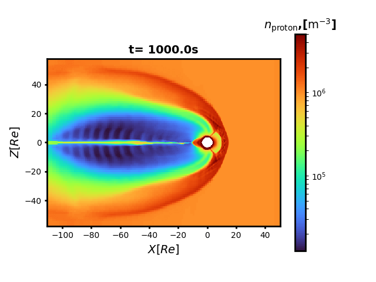

# Examples

## Loading VLSV data

- Read meta data
```
filename = "bulk.0000004.vlsv"
meta = read_meta(filename)
```

- Display all variable names
```
vars = show_variables(meta)
```

- Read variable
```
data = read_variable(meta, "proton/vg_rho")
```

By default the returned variable array is sorted by cell IDs.
If in any case you want the original unsorted version as being stored in the file,
simply say `read_variable(meta, var, false)`.

- Get variable at a given location (This can be simplified even further later!)
```
loc = [2.0, 0.0, 0.0]
id = get_cellid(meta, loc)
read_variable_select(meta, "proton/vg_rho", id)
```

- Get variable along a line between two points
```
point1 = [12Re, 0, 0]
point2 = [15Re, 0, 0]
cellids, distances, coords = get_cell_in_line(meta, point1, point2)
```

Combined with external packages like [FieldTracer.jl](https://github.com/henry2004y/FieldTracer.jl), it is possible to do all kinds of in-depth analysis.
More examples can be found in the [repo](https://github.com/henry2004y/Vlasiator.jl/tree/master/src/examples).

## Plotting

Vlasiator.jl does not have any plotting library as dependency, but it offers plotting functionalities through additional scripts.
To use a specific plotting library, just include the target script (e.g. `pyplot.jl`) under `src/plot` folder:
```
include("src/plot/pyplot.jl")
```

Currently I would recommend using `PyPlot.jl`.
`Plots.jl` is catching up, but it is still slower and lack of features.
`Makie.jl` will be supported in the future if 3D plotting is necessary.

More examples of customized plots can be found in the [repo](https://github.com/henry2004y/Vlasiator.jl/tree/master/src/examples).

Sample outputs:

* Proton density of Earth's magnetosphere in the meridional plane from 3D simulation


* Proton density of Earth's magnetosphere in the equatorial plane from 2D simulation, zoomed in to the magnetosheath and foreshock region, with streamlines and density contour at 1e7


### PyPlot Backend

- Scaler colored contour for 2D simulation
```
plot_pcolormesh(meta, "rho")
```

- Vector z component colored contour for 2D simulation
```
plot_pcolormesh(meta, "rho", op="z", islinear=false, axisunit="Re")
```

- Derived quantity colored contour for 2D simulation (as long as the input variable is in the predefined dictionary)
```
plot_pcolormesh(meta, "b", op="z", islinear=false, axisunit="Re")
```

- Streamline for 2D simulation
```
streamline(meta, "rho_v", comp="xy")
```

The `comp` option is used to specify the two vector components.

!!! note
    Currently there is limited support for derived variables. This will be expanded and changed later for ease of use!

You can choose to use linear/log color scale, plot vector components via e.g. `op="x"` or magnitude by default, and set unit via `axisunit="Re"` etc..

- Cut slice colored contour for 3D simulation
```
plot_colormap3dslice(meta, "proton/vg_rho", normal="y")
```

### Plots.jl Backend

- Scaler colored contour for 2D simulation
```
heatmap(meta, "rho", aspect_ratio=:equal, c=:turbo)
```

- Scaler colored contour with lines for 2D simulation
```
contourf(meta, "rho)
```

This backend supports all available attributes provided by Plots.jl.